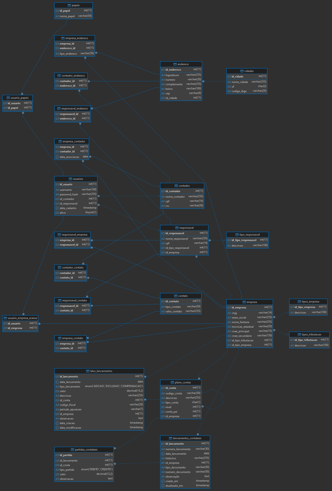

# sistema-contabil-db
Projeto de modelagem de um banco de dados relacional para um sistema contábil, desenvolvido para fins de estudo.
Este repositório contém o projeto de modelagem e implementação de um banco de dados relacional para um sistema contábil. O projeto foi desenvolvido como um exercício prático de aprendizado, aplicando conceitos de modelagem de dados, normalização e SQL.

## Sobre o Projeto

Como contador com décadas de experiência, vivenciei a transição da contabilidade manual para a digital. Este projeto é a materialização dessa jornada, traduzindo as regras de negócio complexas do mundo contábil para uma estrutura de dados robusta e escalável. A filosofia por trás do desenvolvimento segue o princípio de que, para ser um bom construtor, é preciso primeiro ser um bom servente , entendendo profundamente os fundamentos antes de utilizar ferramentas avançadas.

## Modelo de Dados (Diagrama Entidade-Relacionamento)

Abaixo está o diagrama ER que representa a arquitetura atual do banco de dados.

## Tecnologias Utilizadas

*   **SGBD:** MariaDB
*   **Linguagem:** SQL
*   **Ferramentas:** DBeaver, HeidiSQL, Linha de Comando

## Principais Conceitos Aplicados

*   **Modelagem Relacional:** Criação de um esquema lógico a partir de requisitos de negócio.
*   **Normalização:** Aplicação das formas normais (até 3FN) para evitar redundância e anomalias de dados.
*   **Integridade de Dados:** Uso de Chaves Primárias, Chaves Estrangeiras, Constraints (`UNIQUE`, `CHECK`, `NOT NULL`).
*   **Partidas Dobradas:** Implementação de um modelo robusto de Cabeçalho/Itens para os lançamentos contábeis.
*   **Generalização e Padrões de Modelagem:** Criação de tabelas genéricas (endereços, contatos) e uso de tabelas de ligação para relações N:N.
*   **Controle de Acesso (RBAC):** Estrutura inicial para gerenciamento de usuários e papéis.
*   **Multi-Tenancy:** O design do banco de dados foi pensado para suportar múltiplas empresas a partir da visão de um contador.

## Como Usar

1.  Clone o repositório.
2.  Execute o script `schema.sql` em uma instância do MariaDB para criar todas as tabelas.
3.  (Opcional) Execute o script `dados_iniciais.sql` para popular as tabelas de domínio.
